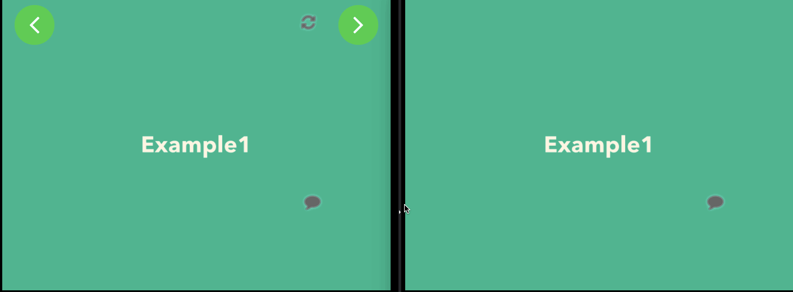
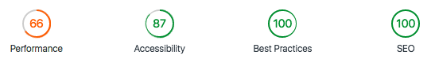

# Last session

Demo
---

  
  

Quick start in local
---

1. npm i -g saku
1. saku init
1. `$ mv .env.example .env` and please modify .env file if needed
1. start up [last-session-server](https://github.com/MaxMEllon/last-session-server) on other terminal
1. saku dev
1. **Please accsess to http://localhost:3000**
> admin mode **http://localhost:3000?&admin=true**

Status
---

Tasks
---

Configured tasks by [saku](https://github.com/kt3k/saku).

- **init** : `saku init`
  > initialize for development
- **dev** : `saku dev`
  > start develop server
- **build** : `saku build`
  > build distributions on production
- **fmt** : `saku fmt`
  > format source code

Show detail: **[:m: saku.md](./saku.md)**

Global dependencies
---

- **node** >= v8.5.0
- **npm** >= v5.5.1
- **saku** >= v0.11.0

.env (example)
----
- SERVER_SOCKET_URL="http://localhost:8080"
- SERVER_REST_URL="http://localhost:8765/api"
- SERVER_IMAGE_URL="http://localhost:8765"

Production settings (nginx)
---

- https://gist.github.com/MaxMEllon/20a716a1ec18bd3bd4f1ffbcb76b0cca

LICENSE
---

- [MIT License](./LICENSE.txt)
  > (c) MaxMEllon (Kento TSUJI)
